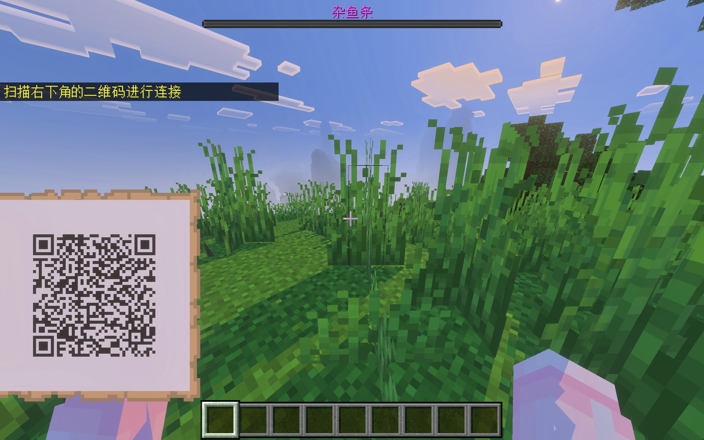

# DaogeLab

A DgLab plugin for Minecraft: Bedrock Edition running in [Allay](https://github.com/AllayMC/Allay) platform.

## Feature

- Supports DGLab device connectivity and control.
- Provide QR code scanning connection interface.
- Injury feedback system.

## Installation

- Download the `.jar` file from release or action.
- Put it in your `plugins` folder.
- Restart the server. Configuration file will be generated in `plugins/DaogeLab/config.yml`
- After editing the configuration file, restart the server again. Enjoy it.

For how to install Allay, please refer to https://docs.allaymc.org.

## Usage

- Enter the server.
- Execute the command `/dglab connect`, and then a QR code will be displayed.
- Open your DgLab APP, choose `Socket Control` and scan the QR code.
- If connected successfully, the strength of A/B channels will be displayed in top right corner.
- Use command `/dglab disconnect` to disconnect.

## Acknowledgement

- [Minecraft-DG-LAB](https://github.com/DancingSnow0517/Minecraft-DG-LAB)
- [DG-LAB-OPENSOURCE](https://github.com/DG-LAB-OPENSOURCE/DG-LAB-OPENSOURCE)

## License

This project is licensed under the MIT License - see the [LICENSE](LICENSE) file for details.